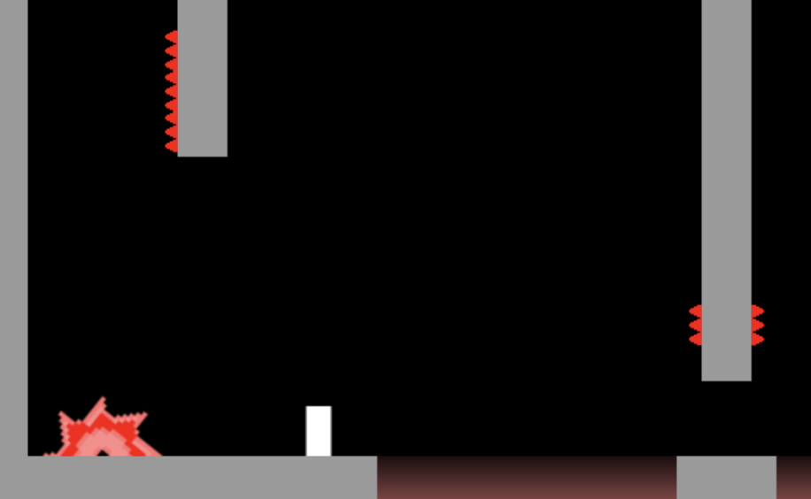

# 1.2 Stakeholders

## Customer Role

Players:\
Players are going to play this game. They will be angry. good.

## Demographics

.png>)

PEGI ratings can have a huge affect on how a game is marketed and sold. According to PEGI's official site, on average games with a lower PEGI rating hold a larger market share (pegi.info, n.d.). Their statistics from 2003 show games rated PEGI 3 hold a 37.1% market share, gradually decreasing as the ratings get higher to only 8.3% for games with a rating of PEGI 18. This does not seem to hold true for recent years however. According to PEGI's official site once again, between the years of 2018 to 2020 there was an increase in market share of PEGI 18 rated games from 10.6% to 16.2%, whereas lower PEGI rated games more or less stayed the same, with a slight decrease to the middles ratings of 12 and 16. These statistics somewhat match statistics from 2020 in Italy (Statista, 2021) showing a majority share for PEGI 3 rated games and a larger share of PEGI 18 rated games.

### How are games rated

PEGI ratings are known to have an impact on how a game is sold, so how are PEGI ratings decided? The&#x20;
